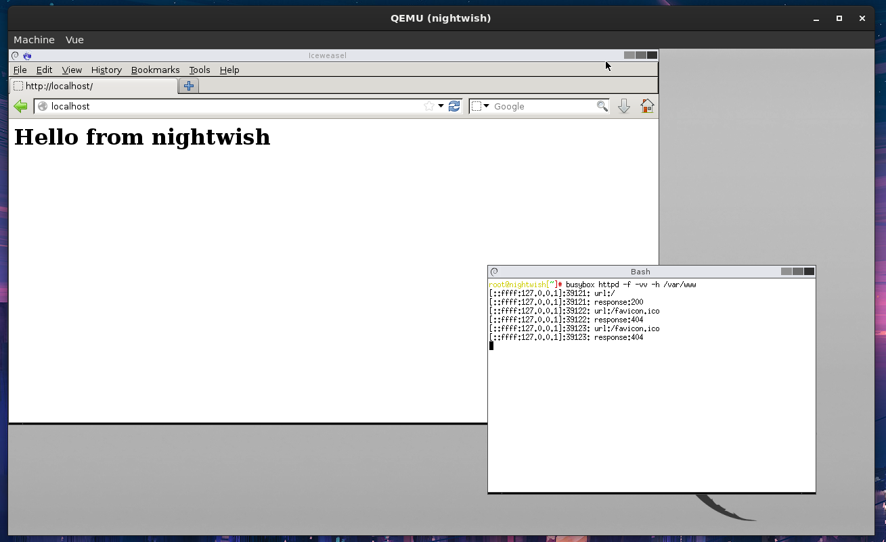
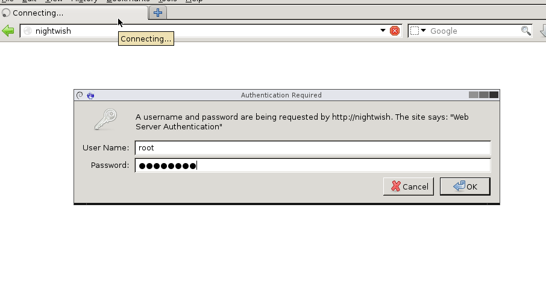

# __Network Administration - Worksheet 1__

> Célian RIBOULET

> S3B"

***

</br>
</br>
</br>
</br>

# System configuration and local networking with Linux

## __User management__

## 3)

After launching all VMs, we can try to change the user password.

I have changed the spy VM password to ```plopplop``` using :

```properties
passwd root
```

## 4)

I have added the user ```celian``` on spy with the password ```plopplop```

```properties
adduser celian
```

</br>
</br>

***

## __System administration__

## 9)

Un réseaux /24 est un réseaux qui possède un masque de sous réseaux de 24 bits
A /24 network is a network having a 24 bits sub-network mask

## 10)

Frist sub-network will be using addresses starting with :
```192.168.0.X```

Second will be using addresses starting with : 
```192.168.1.X```

## 11)

opeth __eth0__ : ```192.168.0.1```

nightwish __eth0__ : ```192.168.0.2```

zonaria __eth0__ : ```192.198.0.3```

opeth __eth1__ : ```192.168.1.1```

(spy) alcest __eth0__ : ```192.168.1.2```

</br>
</br>

***

## __Dynamic configuration__

## 12)

> It is better to use the ip command as it is more modern than ifconfig

opeth eth0 : 

```properties
ip addr add 192.168.0.1/24 dev eth0
```

nightwish eth0 : 

```properties
ip addr add 192.168.0.2/24 dev eth0
```

zonario eth0 : 

```properties
ip addr add 192.168.0.2/24 dev eth0
```

opeht eth1 : 

```properties
ip addr add 192.168.1.1/24 dev eth1
```

(spy) alcest eth0 : 

```properties
ip addr add 192.168.1.2/24 dev eth0
```

We then run the following command on machines (with eth1 if required)

```properties
ip link set eth0 up
```

## 15)

Nightwish and alcest still don't know that they need to use opeth as a gateway to communnicate.

## 16)

In order to setup the gateways, we run the following command : ```route add default gw <ip>```

On nightwish and zonaria: 

```properties
route add default gw 192.168.0.1
```

On alcest : 

```properties
route add default gw 192.168.1.1
```

## 17)

We can know connect from nightwish to opeth over ssh :

```ssh root@192.168.0.1```

## 18)

Sur nightwish
```traceroute 192.168.0.1```

## 19)

In /etc/hosts de nightwish :

```
192.168.0.3     zonaria
192.168.0.1     opeth
192.168.1.2     alcest
```

We can know uses the machines names intead of the IPs

## 20)

All the configurations made with the ip command have not been saved after the reboot
The is beacause we just did a dynamic configuration.

</br>
</br>

***

## __Static configuration__

> The kind of configuration we have done before is not very practical as everything is lost after a restart

## 21) 22) 23) 24) 25)

File ```/etc/network/interfaces``` on opeth :

```
auto lo
iface lo inet loopback

auto eth0 
iface eth0 inet static
    address 192.168.0.1
    netmask 255.255.255.0
    echo > 1 /procs/sys/net/ipv4/ip_forward

auto eth1
iface eth1 inet static
    address 192.168.1.1
    netmask 255.255.255.0
```

## 26)

On nightwish :

Shutdown eth0 interface

```
ifdown eth0
```

Then we make it up again

```
ifup eth0
```

Then we try to ping opeth and it should work

```
ping opeth
```

</br>
</br>

***

## __Web server setup__

## 28)

> Content of the web page that will be runned by the web server


## 29) 30)

> The machine can now acces its own web server using the loopback interface (localhost)



## 31)


## 32)

> We can acces the website using th host IP address


## 32 to 42

> Some tests with wireshark

## 42)

> I then tried to do some authentication on the web server


