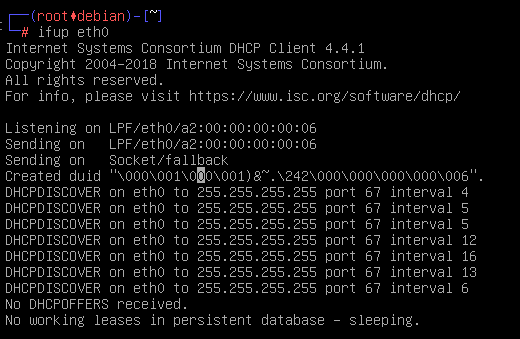

# DHCP

> **Riboulet Célian** ```S3B"```

***


### 2) Choosing addresses for both dhcp servers

**dhcp1 :**

```bash
ip addr add 192.168.1.1/24 dev eth0
```


**dhcp2 :**

```bash
ip addr add 192.168.2.1/24 dev eth0
```


### 3) Interfaces configuration on both DHCP servers

**Added lines on ```/etc/network/interfaces``` for dchp1 :**

```bash
auto eth0
iface eth0 inet static
 address 192.168.1.1
 netmask 255.255.255.0
```

**Added lines on ```/etc/network/interfaces``` for dchp2 :**

```bash
auto eth0
iface eth0 inet static
 address 192.168.1.1
 netmask 255.255.255.0
```

Et on fais ip link set eth0 up

### 4) Enabling interfaces on both dhcp servers

We can use the following command to take in consideration the changes in ```/etc/network/interfaces``` we have just made.

```bash
ip link set eth0 up
```

### 5) Activating the DHCP service on both servers

Adding the following line to ```/etc/default/isc-dhcp-server``` in order to enable the dhcp service on the eth0 interface.

```
INTERFACESv4="eth0"
```

### 6) Configuring Clients so they can get an IP address by requesting the DHCP service

Into both client's ```/etc/network/interfaces``` :

```
iface eth0 inet dhcp
```

### 7) Enabling client1 interface

We first use :

```
ifup eth0
```



After around one minute, the client does not have received any offer from the DHCP server, this is beacause the DHCP service is not yet completly configured.

### 8) Configuring dhcp1 subnet

We now have to edit the ```/etc/dhcp/dhcpd.conf``` file on dhcp1 in order to setup the DHCP service.

```
subnet 192.168.1.0 netmask 255.255.255.0 {
}
```

### 9) Restarting the DHCP service on dhcp1

```bash
systemctl restart isc-dhcp-server
```

> This has to be done after any modiciation in ```/etc/dhcp/dhcpd.conf```

### 10) Checking DHCP service status

```systemctl status isc-dhcp-server
systemctl status isc-dhcp-server
```


### 11) Starting wireshark in graphic mode on dhcp1

In order to see incoming packets from the clients, we will use wireshark.

```bash
startx && wireshark -i eth0 -k
```

### 12-13) Start client1 network interface in debug mode

```bash
dhclient -d eth0
```

The dhcp1 server does see the DHCP Discover request from client 1 but is not giving back an offer.


> The DHCP is not responding a DHCP Offer, this is because we haven't setup the available addresses range into the server's ```etc/dhcp/dhcpd.conf``` file. The server is actually not able to give an available IP address to any client.


### 14) Addresses range setup on the DHCP server

Editing the ```/etc/dhcp/dhcpd.conf``` file on dhcpd1 :

```
subnet 192.168.1.0 netmask 255.255.255.255 {
 range 192.168.1.3 192.168.1.13
}
```

### 15) Testing wireshark with the new configuration

The client1 machine now have a respond of his offer and can now request to have an available IP addresse.


### 16) The network configuration on client1 given by the DHCP server


> The ip addresse is here ```192.168.1.3``` and is in the range we've set into the dhcp configuration on dhcp1

### 17) Checking if client1 and dhcp1 can communicate


### 19) Releasing the DHCP lease on client1


### 20) client1 mac address

```
a2:00:00:00:00:00:07
```

### 21) Giving client its own static IP

Editing the ```/etc/dhcp/dhcpd.conf``` file on dhcp1


We also change the client2 hostname by editing his file ```/etc/hostname``` 

### 22) Starting both clients network interfaces

Client 2 :


### 23) Checking both clients network configurations

Both configuration can be check by using :

```
ip addr
```

> Client2 does have the IP 192.168.1.20 as we wave configured it in the dhcp server's config file.


### 24) Checking if both clients can communicate

Here client2 can communicate with client1 and dhcp1 :


### 25) Releasing client's DHCP leases

```
dhclient -r eth0
```

### 26) Changing the default lease time

We have to edit the ```/etc/dhcp/dhcpd.conf``` file on dhcp1 in order to change de lease time :


### 28) Lease time

The lease is renewed every 15 secondes


### 29) Same addresses ?

All clients has the same addresses after a renewal, this is the main goal of asking the dhcp server for a renewal.


### 30-31) Shuting down the DHCP service

```
systemctl stop isc-dhcp-server
```

> Both clients are now not able to renew their lease (As expected)


### 32) Restarting the DHCP service with clients running

Clients stay in "sleeping" mode and are not looking for a new lease, even if the dhcp service is up again

### 33) Releasing clients leases

```
dhclient -r eth0
```

### 34) Seting up client3 and dhcp2

mon client3 ne boot pas :/


### 35) Linking eth1 interfaces for both servers

On both dhcp servers :

```
iface eth1 inet dhcp
```

We also have to run the following command in order to enable the ip forwading :

```
echo 1 > /proc/sys/net/ipv4/ip_forward
```

### 36) Starting eth1 interface on both servers

```
ifup eth1
```

### 37) Checking IP addresses for both servers

on dhcp2 :


### 38) Checking if both servers can communicate

On dhcp2 :


### 39) Setting up the default gateway on dhcp1

We have to edit one more time the ```/etc/dhcp/dhcpd.conf``` file on dhcp1.

In the subnet block we add :

```
option routers 192.168.1.1;
```

### 40) Setting up the default gateway on dhcp2

```
option routers 192.168.2.1;
```

### 41)

```
systemctl restart isc-dhcp-server
```

### 44)

On client 1 (ping to dhcp2 -> client3 is down but its the same network)


