### TP DNS

> Riboulet Célian S3B"

***

#### 2) DHCP setup on LAN USER machines

In `/etc/network/interfaces` for dns1 dns2 client1 client2

```
iface eth0 inet dhcp
```

All addresses are set by the dhcp server on root

### 3) Adresses

```
dns1 : 192.168.0.1
dns2 : 192.168.0.2
client1 : 192.168.0.10
client2 : 192.168.0.20
```

#### 4) Ping between LAN USER machines


#### 5) Routing tables


---

#### 7) Changing local host name

In **dns1** `/etc/hosts` 

```
192.168.0.2     dns2
192.168.0.10    client1
192.168.0.20    client2
```

#### 8) Ping using  hostname

> From dns1


#### 9) /etc/resolv.conf

> Checking the file on all machines


#### 10) Forcing to use our own dns server

> Editing `/etc/dhcp/dhclient.conf`

On **dns1** and **dns2** :

```
supersede domain-name-servers 127.0.0.1;
```

On **client1** :

```
supersede domain-name-servers 192.168.0.1;
```

On **client2** :

```
supersede domain-name-servers 192.168.0.2;
```

#### 11) Restarting interfaces on all machines

After `ifdown eth0 && ifup eth0` the content of `/etc/resolv.conf` is now :

- for **dns1** and **dns2** :
  
  - ```
    nameserver 127.0.0.1
    ```

- for **client1** :
  
  - ```
    nameserver 192.168.0.1
    ```

- for **client2** :
  
  - ```
    nameserver 192.168.0.2
    ```

#### 12) DNS forwarding

`/etc/bind/named.conf.options` on **dns1** and **dns2** :

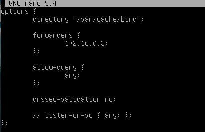

#### 13) Configuring primary server (dns1)

> Add add a new dns zone on `/etc/bind/named.conf.loal`

```
zone "netas" {
    type master;
    file "/etc/bind/db.netas";
};
```

#### 14) Filling dns zone file

```
cp /etc/bind/db.empty /etc/bind/db.netas
```

#### 15) Updating zone file header

#### +16) Adding NS entry

`/etc/bind/db.netas`

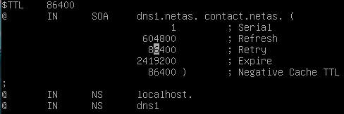

#### 17) Adding `A` entry

`/etc/bind/db.netas`


#### 18) Restarting the DNS service

```
systemctl restart named
```

> We can also just reload the configuration without having to restart
> 
> ```
> systemctl reload named
> ```

> Check possible errors with :
> 
> ```
> journalctl -u named
> ```

#### 19) Checking status

> To check the service status
> 
> ```
> systemctl status named
> ```

> 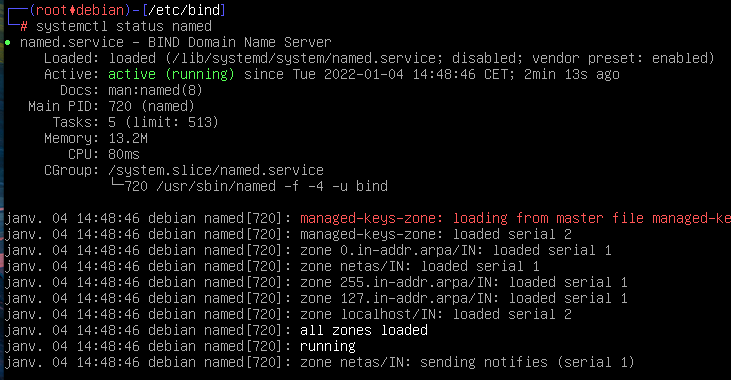

#### 20) Ping from client to dns1 using its domain name

> From **client1**


#### 21) Adding `A` entry for dns2

> The file is still  `/etc/bind/db.netas`

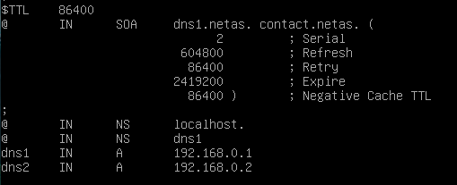

Dont forget to increment the Serial number and `systemctl reload named`

#### 22) Adding `CNAME` entries (aliases)


`<increment> Serial + systemctl reload named`

#### 23) Testing config from client

> On **client1**


#### 24) Adding an `NS` entry to identify dns2 as a zone

`/etc/bind/db.netas`

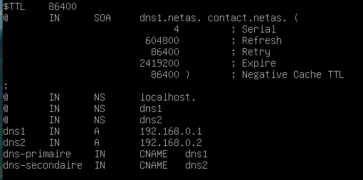

#### 25) Setting up netas as secondary on dns2

> On `/etc/bind/named.conf.local`

```
zone "netas" {
    type slave;
    file "/var/lib/bind/db.netas";
    masters { 192.168.0.1; };
};
```

#### 26) Starting up DNS2 and checking with ping

```
systemctl restart named
```

Then on **client2** :

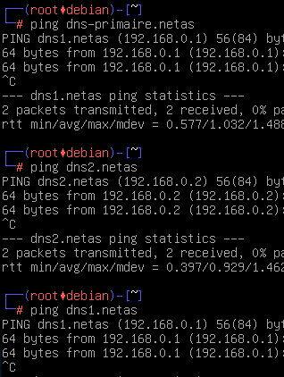

#### 27) Using `host` command on clients


#### 28) Comparing dns2 and dns1 `db.netas` file

The file on dns2 seams to have the same content as dns1 but in another format (Compressed ?)

#### 29) What is a /22 netmask

A /22 netmask is a mask has 22 bits dedicated to identify the network and the others are used to identify the computer.

192.168.0.(0-255)

192.168.1.(0-255)

192.168.2.(0-255)

192.168.3.(0-255)

#### 30) Scanning the network to get all IPs

On **dns1** :

```
nmap -T5 -sP 10.0.0.0/22
```

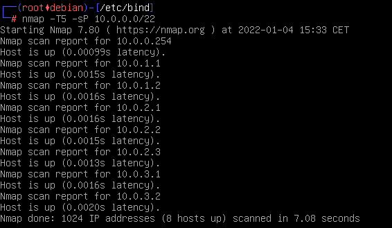

#### 31) Connect over ssh to all found IPs

```
ssh tc@<ip>
```

```
10.0.0.254   root
10.0.1.1     a1
10.0.1.2     a2
10.0.2.1     s1
10.0.2.2     s2
10.0.2.3     s3
10.0.3.1     p1
10.0.3.2     p2
```

#### 32) Add an `A` entry for `s1` `s2` and `s3` web servers

`/etc/bind/db.netas`


> Serial number bumped up to 5
> 
> `systemctl restart named`

#### 33) Add a `CNAME` entry for the 3 web servers

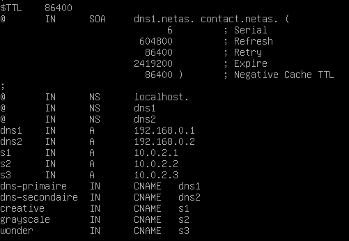

**34)** Test from client1 and client2

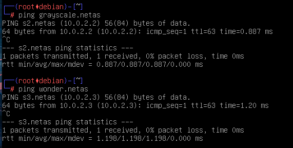

#### 35) 36) 37) Start web browser on client 1 and then client2

```
startx
```


#### 38) Declaring inverse domain name zone for netas

> `/etc/bind/named.conf.local` on `dns1`


> `/etc/bin/db.netas-rev`


#### 39) Check on client if the reverse domain name is working

> On client2
> 
> 

#### 40) Update dns2 configuration

> In order for dns2 to become a secondary server on the reverse netas zone

`/etc/bind/named.conf.local`

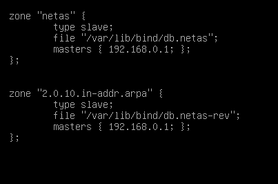

#### 41) Testing on client2


> Before and after the setup

#### 42) Add new NS entry to the netas zone (subdomain setup)


#### 43) Declaring the new subdomain

`/etc/bind/named.conf.local`


#### 44) Creating zone file

`/etc/bind/db.perf.netas`


#### 45) Adding A entries for p1 and p2

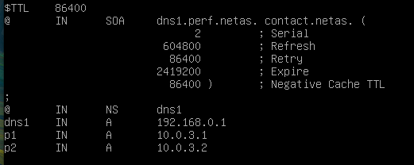

#### 46) Check on client1


#### 47) Share A between p1 and p2


#### 48) Pinging scale.perf.netas on client1

The pinged IP does change randomly between the p1 and p2 IPs

#### 49) Installing iperf on client1 and client2


#### 50) Updating dns1 and dns2 so dns2 is a secondary server on the `perf.netas` zone

`named.conf.local` on `DNS2`


#### 51) Ping from client2


#### 52) Speed test on client1 & client2


#### 53)
