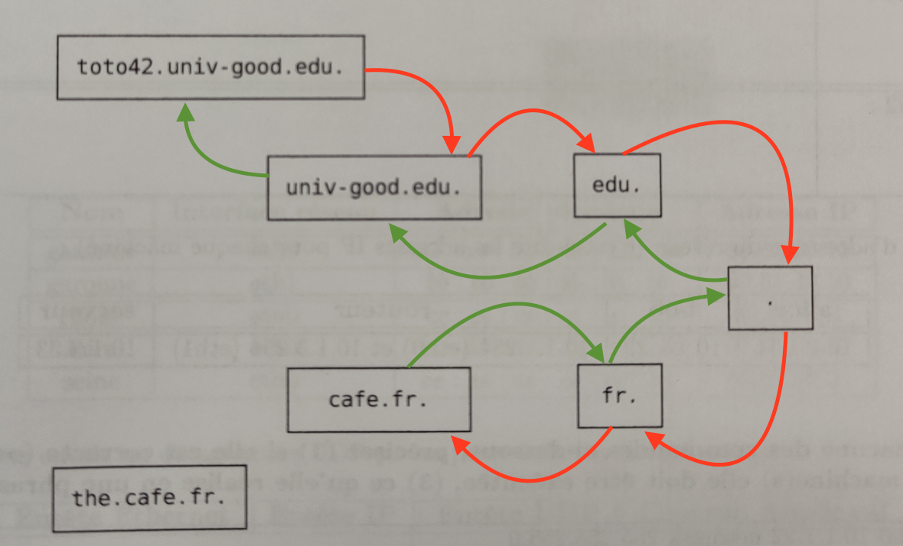
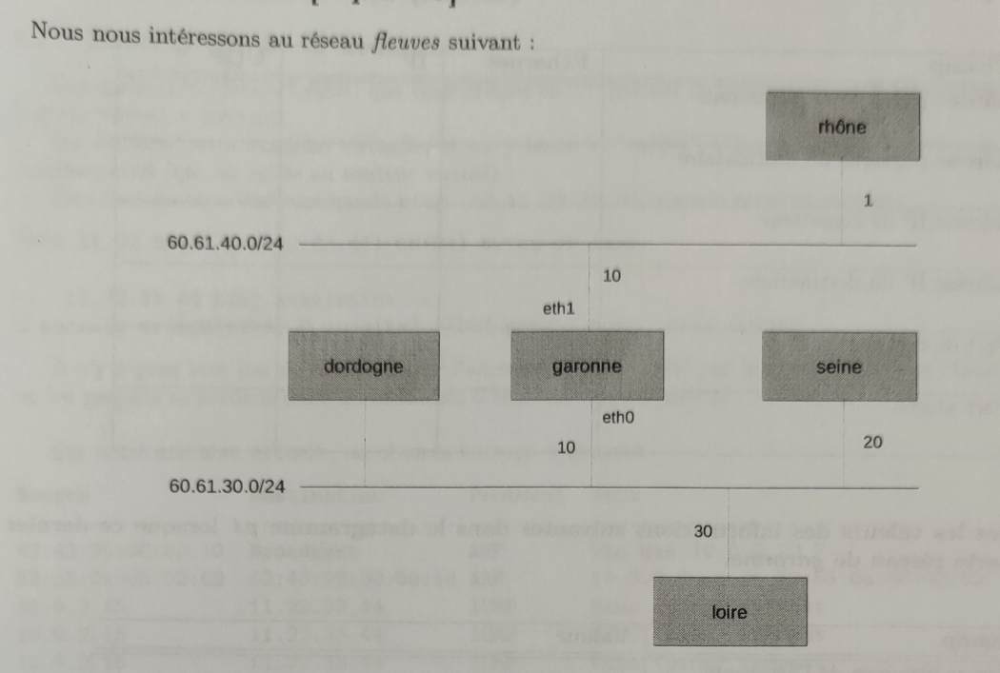
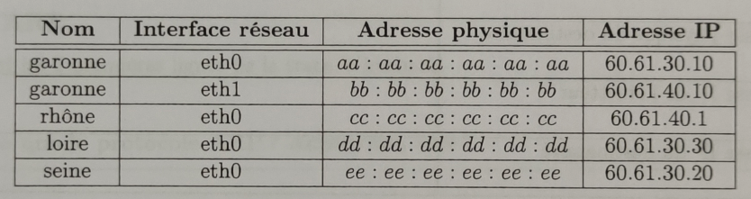
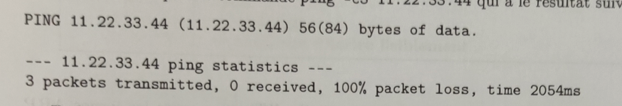
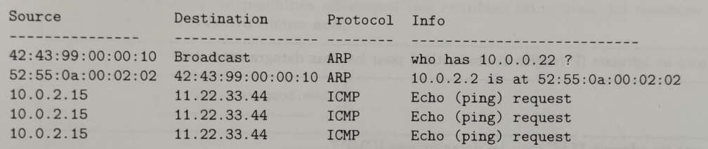

# DS 2020-21 Correction

> Auteurs : Guillaume et Célian

---

### 1/ DNS

**1)** Indiquer (avec des flêches et des numéros) les étapes DNS pour obtenir l'IP de `the.café.fr.` sachant que vous effectuez une requête récursive depuis la machine `toto42.univ-good.edu.` .

On considère ici que toutes les machines effectuent des requêtes récursvices. La machine `cafe.fr` est le serveur DNS de la zone du même nom.



> Méthode récursive ? 
> 
> - On demande à un serveur DNS de nous donner l'adresse IP d'un nom de domaine.
> 
> - Le serveur ne connaît pas l'adresse IP correspondante et demande donc à son serveur DNS supérieur (récursivement).
> 
> - Une fois que l'on est tombé sur un serveur connaissant l'adresse IP, il nous la redonne en parcourant toute la chaîne de serveurs par lequelles la demande est passée.

> Il existe une autre méthode, la méthode itérative :
> 
> 

---

### 2/ Routage


Adresse réseaux de LAN1 : `10.1.1.0/24`

Adresse réseau de LAN2 : `10.1.3.0/24`

**2) Qu'est ce que cela signifie ?**

|            | Adresses disponibles   | Masque          | Broadcast    | Adresse réseau |
| ---------- | ---------------------- | --------------- | ------------ | -------------- |
| Pour LAN1: | `10.1.1.1``10.1.1.254` | `255.255.255.0` | `10.1.1.255` | `10.1.1.0`     |
| Pour LAN2: | `10.1.3.1``10.1.3.254` | `255.255.255.0` | `10.1.3.255` | `10.1.3.0`     |

> Dans un réseaux `/24`, le masque de sous réseau masque 24 bits sur les 32 bits de l'adresse.
> 
> Il y a donc 8 bits non masqués (Les valeurs théoriques libres vont donc de 0 à 255) mais 0 est réservé au réseau en lui même et 255 est l'adresse de broadcast.

**3) Pour chacune des commandes ci dessous, préciser :**

- Si elle est correcte.

- Sur quelle(s) machine(s) elle doit être effectuée.

- Qu'est ce qu'elle réalise.

| Commandes                                        | Correcte?                  | Machines?        | Descriptions                                                                                               |
| ------------------------------------------------ | -------------------------- | ---------------- | ---------------------------------------------------------------------------------------------------------- |
| `ifconfig eth0 10.1.1.22 netmask 255.255.255.0`  | Oui                        | Sur Bob          | Configure l'interface réseau eth0 sur Bob                                                                  |
| `ifconfig eth0 10.1.3.33 netmask 255.255.255.0`  | Non, car on configure eth1 | Sur serveur      | Configure l'interface réseau eth1 sur serveur                                                              |
| `route add default gw 10.1.1.254`                | Oui                        | Sur Alice et Bob | Indique que la passerelle par défaut de toutes les machines du sous-réseau 10.1.1.254 sera eth0 du routeur |
| `ifconfig eth1 10.1.3.254 netmask 255.255.255.0` | Oui                        | Sur routeur      | Configure l'interface réseau eth1 sur routeur                                                              |

---

### 3/ Encapsulation





**4) Donnez les valeurs des informations suivantes dans le datagramme `p1` lorsque ce dernier sort de la carte réseau de `rhône`**

| Champ                         | Valeur                        |
| ----------------------------- | ----------------------------- |
| Adresse physique emetteur     | `cc:cc:cc:cc:cc:cc` (rhone)   |
| Adresse physique destinataire | `bb:bb:bb:bb:bb:bb` (garonne) |
| Adresse IP de l'émétteur      | `60.61.40.1` (rhône)          |
| Adresse IP du destinataire    | `60.61.30.30` (loire)         |

> L'adresse physique du destinataire est celle de la passerelle étant donné que l'adresse IP du destinataire n'appartient pas au même réseau.

**5) Dans quelles entêtes trouve-t-on les informations suivantes :**

| Champ                            | Ethernet | IP  | UDP |
| -------------------------------- | -------- | --- | --- |
| Adresse physique de l'émetteur   | X        |     |     |
| Adresse physique du destinataire | X        |     |     |
| Adresse IP de l'émetteur         |          | X   |     |
| Adresse IP du destinataire       |          | X   |     |
| Port de destination              |          |     | X   |
| Port source                      |          |     | X   |

**6) Donnez les valeurs des informations suivantes dans le datagramme `p1` lorsque ce dernier sort de la carte réseau de `garonne`**

| Champ                         | Valeur                        |
| ----------------------------- | ----------------------------- |
| Adresse physique emetteur     | `aa:aa:aa:aa:aa:aa` (garonne) |
| Adresse physique destinataire | `dd:dd:dd:dd:dd:dd` (loire)   |
| Adresse IP de l'émétteur      | `60.61.40.1` (rhône)          |
| Adresse IP du destinataire    | `60.61.30.30` (loire)         |

> Uniquement les adresse MAC ont changé entre les deux sous réseaux.

---

### 4/ Mise en situation

La commande suivante est lancé sur une machine virtuelle :

```
ping -c3 11.22.33.44
```



> Le ping na pas de réponse

Voici la trace WireShark du ping :



**7) Qu'est ce que le protocole ARP**

> `Address Resolution Protocol`  
> 
> Permet d'obtenir l'adresse MAC (physique) d'une machine via son adresse IP (donc son adresse logique).

**8) Qu'est ce que l'adresse `42.43.99.00.00.10` de la première ligne**

> Il s'agit de l'adresse MAC source du ping, soit celle de la machine ayant effectué le ping.

**9) Expliquez le broadcast de la première ligne**

> L'emetteur envoit en broadcast, c'est à dire à toutes les machines du réseau une requête ARP.
> 
>  (Seule la passerelle répond car elle voit que la machine demandée n'est pas dans le même réseau).

**10) A quoi correspond l'adresse 10.0.0.22 de la première ligne ?**

> Il s'agit de l'adresse IP de la passerelle par laquelle on passe pour aller ping l'adresse 11.22.33.44 car elle n'est pas dans le réseau actuel.

**11) A quoi correspond l'adresse `52:55:0a:02:02` de la deuxième ligne**

> Il s'agit de l'adresse MAC de la passerelle.

**12) Qu'est cre qu'ICMP ?**

> `Internet Control Message Protocol`
> 
> Permet de faire des test afin de voir si le réseau est bien configuré.

**13)a) A votre avis, la présentation des adresses est-elle différente entre les lignes ARP et ICMP ?**

> Oui, car les protocoles n'ont rien à voir entre eux. En effet, le protocole ARP se situe dans la couche **physique/réseau** et n'a donc même par connaissance de la notion d'**IP** alors que le protocole ICMP se trouve dans la couche **internet**.

**13)b) Quelles sont les adresses IP (source et destination) pour les deux datagrammes ARP ?**

> Il n'y en a pas, car ARP est au niveau de la couche liaison.

**13)c) Quelles sont les adresses MAC pour les datagrammes ICMP ?**

> Emetteur: `42:43:99:00:00:10`
> 
> Destinataire: `52:55:0a:00:02:02`

**14) De ce qui précède, déduisez les informations concernant le routage de la machine virtuelle.**

> On en déduit que la passerelle a pour adresse IP: `10.0.0.22`

**15) Si vous deviez configurer la machien virtuelle à la main, quelles commandes lanceriez-vous ?**

> `ifconfig eth0 10.0.0.15/24`
> 
> `route add default gw 10.0.0.22`