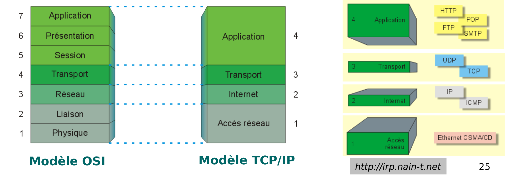
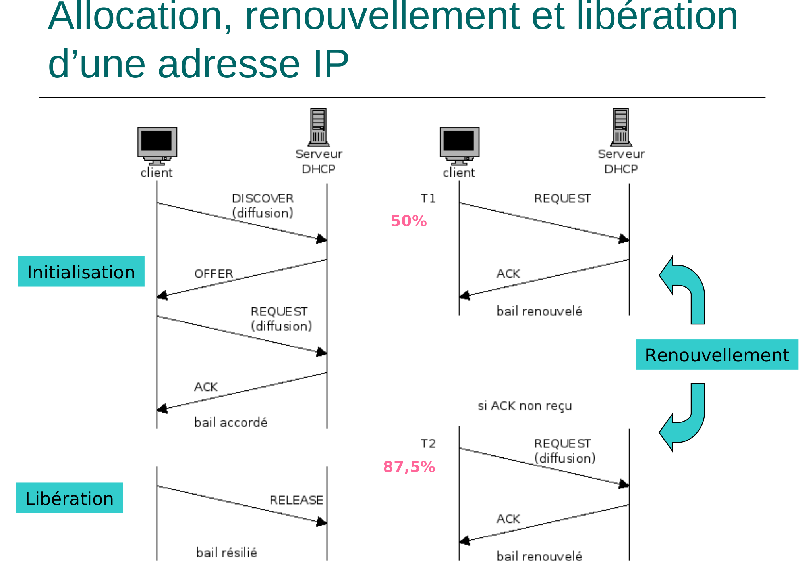

## Qu'est ce que Internet ?

Internet est une **interconnexion de réseaux**.

> C'est un réseau de réseau ou de sous-réseaux.

## Caractéristiques de internet

- Un ensemble de logiciels et de **protocoles**

- Basé sur l'architecture **TCP/IP**

- Fonctionne en grande partie en mode **client/serveur**

- Un ensemble de **services** (Mail, connexions à distance, transferts de fichiers, etc)

## Modéle TCP/IP

Il s'agit d'un modéle se divisant en 4 couches différentes:

1. **Accès Réseau**: Protocoles actifs, accès client/serveur
   
   1. **HTTP**: HyperText Transfert Protocle, c'est un protocole de communication.
   
   2. **POP**: Post Office Protocole, c'est un protocole permettant de récupérer les courries électroniques.
   
   3. **FTP**: File Transfert Protocole, c'est un protocole destiné au partage de fichiers.
   
   4. **SMTP**: Simple Mail Transfert Protocole, c'est un protocole pour transférer le courrier électronique vers les serveurs de méssagerie électroniques.
   
   5. **DNS**: Domain Name System, c'est un dictionnaire géant permettant de traduire les adresses IP en noms de domaines.
   
   6. **DHCP**: Dynamic Host Configuration Protocole, c'est un protocole affectant automatique à un utilisateur un numéro IP, un masque de sous-réseau ainsi qu'une passerelle par défaut.

2. **Transport**: 
   
   1. **TCP** (Transfert fiable en mode connecté)
   
   2. **UDP** (Transfert non fiable, mode déconnecté)

3. **Internet**: 
   
   1. **IP** : Internet Protocole, c'est un protocole de communication pour le réseau internet. 2 types d'adresses IP différentes:
      
      1. **IPV4**: Adresses sur 4 octets, 2³² adresses possibles.
      
      2. **IPV6**: Adresses sur 6 octets, 2¹²⁸ adresses possibles.
   
   2. **ICMP** : Internet Control Message Protocole, c'est un protocole de signalement d'erreurs.
   
   3. **ARP**: Address Resolution Protocole, c'est un protocole permettant de faire le lien entre l'adresse IP et l'adresse MAC d'une machine.

4. **Application**: 
   
   1. **Ethernet**: Protocole de réseau local (LAN) à communication de paquets.

Ci-dessous, un schéma récapitulatif des modéles **OSI** et **TCP/IP**.



---

# DHCP

> Permet à des machines clientes de **recevoir** automatiquement leurs **paramètres de configuration réseau** (adresses IP, masque et passerelles) lorsqu'elles se connectent sur un réseau local.

## 1. Intérêts

Le DHCP a de nombreux intérêts, nottament:

* Fonctionnement **centralisé** au sein d'un réseau
  
  * Chaque personne en bénéficie au prochain démarrage.

* Favorise le changement de réseau des wifi publics

## 2. Principe

Le **DHCP** fonctionne de la manière suivante:

1. Une machine démarre et envoie une **requête** DHCP en **broadcast**

2. Le serveur DHCP répond à **l'adresse MAC** du client en lui fournissant:
   
   1. Un numéro IP
   
   2. Des informations réseaux (masque, passerelle, etc)

## 3. Détails du protocole DHCP

Ce protocole se situe dans la couche **Application** du modéle **TCIP/IP**.

Il utilise:

* Le port 68 (port client)

* Le port 67 (port serveur)



**ACK**: Acquittement, message de confirmation de bonne réception envoyé par le serveur au client.

### Messages client du protocole DHCP

* **DHCPDISCOVER**: Découverte de serveurs

* **DHCPREQUEST**: Demande de bail

* **DHCPDECLINE**: Refus d'adresse

* **DHCPRELEASE**: Libération du bail

* **DHCPINFORM**: Demande de configuration réseau (autre que l'adresse IP)

### Messages serveur du protocole DHCP

* **DHCPOFFER**: Offre de bail

* **DHCPACK**: Validation de bail et configuration du réseau

* **DHCPNACK**: Refus de bail*

## 4. Configuration

### Configuration client

* Fichier `/etc/network/interfaces`
  
  * ```bash
    auto eth0
    iface eth0 inet dhcp
    ```

* `/var/lib/dhcp/dhclient.leases`: Contient les baux accordés

### Configuration serveur

* Fichier `/etc/dhcp/dhcpd.conf`
  
  * ```bash
    default-lease-time 600;
    max-lease-time 7200;
    
    subnet 192.168.10.0 netmask 255.255.255.0 {
        range 192.168.10.100 192.168.10.150 ;
        host server{
            hardware ethernet a0:00:01:02:03:04 
            fixed-address 192.168.10.200 ;
        }
        option routers 192.168.10.1 ;
    }
    ```

* `/var/lib/dhcp/dhcpd.leases`: Contient l'es baux accordés

---

# DNS

> **Domain Name System**:  Cela permet de nommer des ressources sur Internet. Il en est un composant vital.

Il permet nottament de :

* Faire de la résolution de noms
  
  * Numéro IP de assomniak.fr ?

* Faire de la résolution inverse 
  
  * Nom de 127.0.0.1 ?

* Il fournit des services
  
  * Quelles machine reçoit le courrier pour assmoniak.fr ?


Exemple:

> * info-ssh1.iut.u-bordeaux.fr fait partie du domaine **zone**  iut.u-bordeaux.fr
> 
> * qui est un **sous-domaine** de u-bordeaux.fr
> 
> * qui est dans le **Top Level Domain**(TLD) national fr
> 
> * qui est un **enfant** de la racine (root)

### Serveurs, redondance

> Les informations sur une zone sont détenues par **un serveur maître** et **quelques erveur esclaves.**

### En résumé

* **Serveur maître:** Il lit les données et les communiques à ses serveurs esclaves.

* **Serveurs esclaves:** Obtient les données du serveur maître après leur configuration. Les serveurs esclaves servent de backups au serveur maître.

> Chaque zone
> 
> * Est décrite par des serveurs (maîtres et esclaves)
> 
> * Connaît les serveurs de noms des sous-domaines.
> 
> Par exemple, la zone ".fr" cotient le nom "u-bordeaux.fr" et les noms qui s'en occupent.

## Résolution

Il y a deux méthodes de résolutions possibles:

1. Via des requêtes **récursives**


2. Via des requêtes **itératives**


* Les résultats intermédiares sont mémorisés dans le **cache** afin de ne pas avoir à les redemander.

* Ils ont une **durée de vie (TTL= Time To Live)**

## Configuration client

`/etc/resolv.conf: `

```bash
search maison.net
domain maison.net
nameserver 10.4.2.254
```

`/etc/nsswitch.conf`:

```bash
hosts files dns
```

## Configuration serveur, déclaration d'une zone et de son inverse

`/etc/bind/named.conf ou /etc/bind/named.conf.local`:

```bash
zone "maison.net" {
    type master;
    file "/etc/bind/db−maison.net";
};
zone "2.4.10.in−addr.arpa" {
    type master;
    file "/etc/bind/db−2.4.10";
};
```

## Configuration serveur, défintion d'une zone

`/etc/bind/db-maison.net`: 

```bash
@ IN SOA entree.maison.net. admin.maison.net. (
2019091702;    Serial
604800;        Refresh
86400;         Retry
2419200;       Expire
604800);       NegativeCacheTTL
@         IN    NS    entree.maison.net.
@         IN    MX10  entree
entree    IN    A     10.4.2.254
salon     IN    A     10.4.2.253
escalier  IN    A     10.4.2.250
living    IN    CNAME entree
etage     IN    NS    escalier.maison.net.
```

## Configuration serveur, défintion d'une zone inverse

`/etc/bind/db-2.4.10`:

```bash
@ IN SOA entree.maison.net. admin.maison.net. (
2019100822;     Serial
604800;         Refresh
86400;          Retry
2419200;        Expire
604800);   Negative Cache TTL
@     IN NS entree.maison.net.
254   IN PTR entree.maison.net.
253   IN PTR salon.maison.net.
250   IN PTR escalier.maison.net.
```

## Configuration du serveur, pièges courants

* **NE PAS OUBLIER LES "."  EN FIN. Sans le point, c'est relatif à la zone courante.**

* **Ne pas oublier la résolution inverse**

* **Penser à augmenter le numéro de version à chaque modification**

---

# Quelques commandes et définitions utiles

**Masque de sous-réseau**: Détermine la partie de l'adresse correspondante au réseau. 

**Adresse/24**: Signifie que les 24 bits les plus à gauches sont réservés au masque de sous-réseau.

**Passerelle**: Dispositif permettant de relier deux réseaux internet différents, comme par exemple le réseau local avec le réseau internet.

**ifconfig**: Permet d'avoir des informations sur des interfaces réseaux.

**ifup eth0**: Permet d'activer l'interface réseau eth0.

**ifdown eth0**: Permet de désactiver l'interface réseau eth0.

**host google.com**: Permet d'interroger les DNS de google.

**host 8.8.8.8**: A partir de l'adresse, trouver le nom.