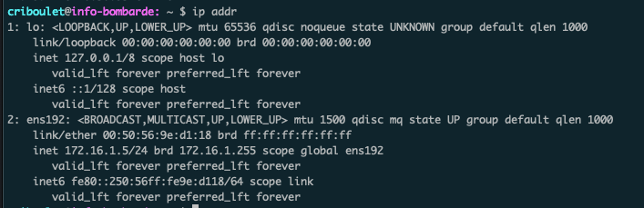
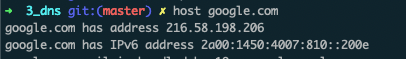
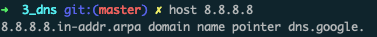

## Configuration pérenne

> Toutes les configurations réalisée via les commandes suivantes de sont pas sauvegardés entre 2 redémarrage de l'ordinateur / interfaces réseaux.

</br>

`ip addr` 

> Affiche la configuration réseau de la machine (Adresse IP nottament)

> 

</br>

`ifup eth0`

> Lance l'interface réseau eth0 de la machine

</br>

`ifdown eth0`

> Stop l'interface réseau eth0

</br>

`ip addr add 192.168.1.2/24 dev eth0`

> Donne à l'interface eth0 l'adresse `192.168.1.2` et le masque `255.255.255.0`

</br>

`route add default gw 192.168.0.1`

> Configure l'adresse `192.168.0.1` comme étant l'adresse de la passerelle à utiliser.

***

## Configuration statique

`/etc/network/interfaces`

> Fichier contenant les configurations des interfaces

```
auto lo
iface lo inet loopback

auto eth0 
iface eth0 inet static
    address 192.168.0.1
    netmask 255.255.255.0
    echo > 1 /procs/sys/net/ipv4/ip_forward
```

## Requests commands

`host google.com`

> Interroge les serveurs DNS de google



</br>

`host 8.8.8.8`

> Résolution DNS inverse (IP vers nom de domaine).



---

## SystemCTL

`systemctl <action> <service>`

Actions :

- `restart`

- `status`

- `reload`

Services :

- `isc-dhcp-server` (serveur dhcp)

- `named` (serveur dns)